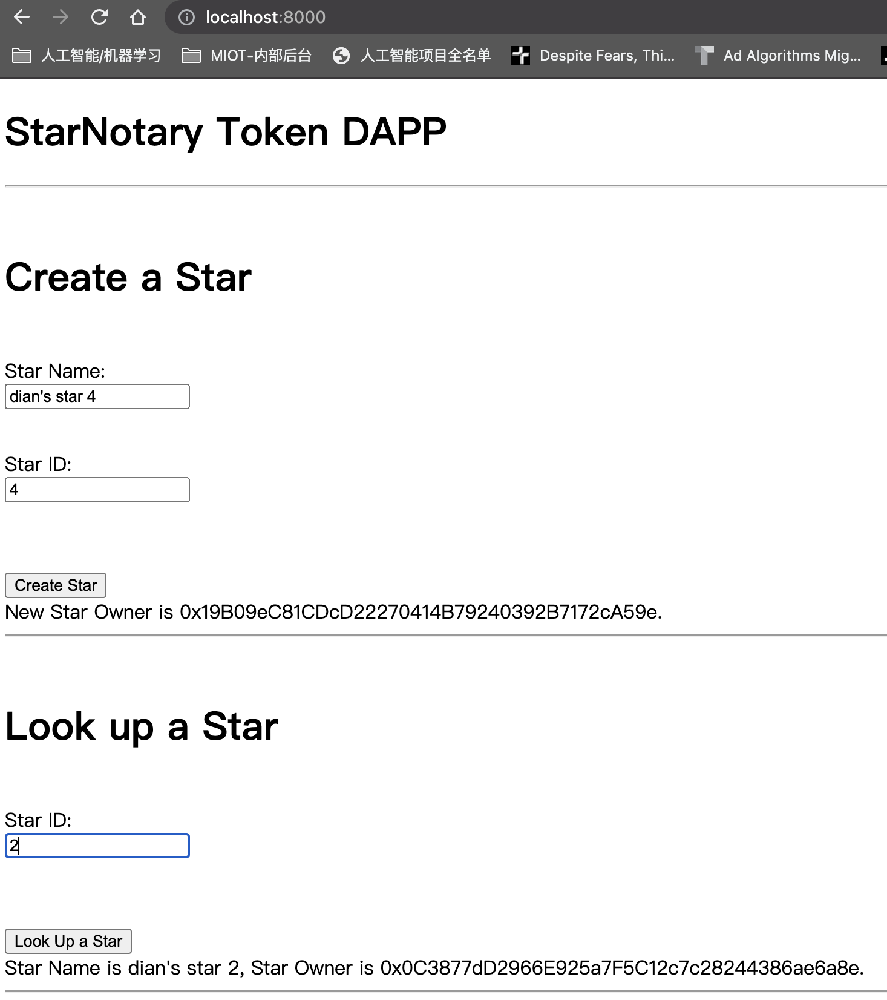
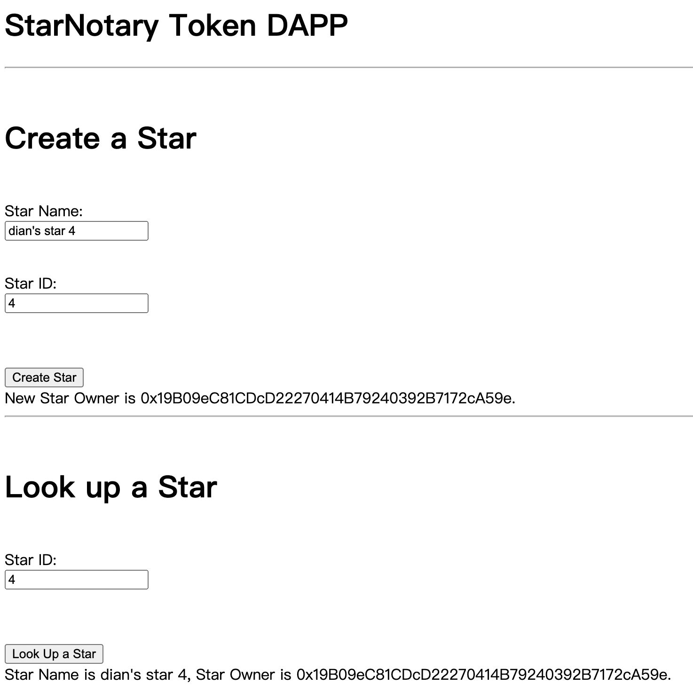

# ND1309 C2 Ethereum Smart Contracts, Tokens and Dapps - Project Starter 
**PROJECT: Decentralized Star Notary Service Project** - For this project, you will create a DApp by adding functionality with your smart contract and deploy it on the public testnet.

### Dependencies

```bash
root@0c227cbd3cc5:/mnt/devroot/src/udacity-p2-nd1309-starnotary# truffle version
Truffle v5.4.6 (core: 5.4.6)
Solidity - 0.5.16 (solc-js)
Node v12.20.0
Web3.js v1.5.1

root@0c227cbd3cc5:/mnt/devroot/src/udacity-p2-nd1309-starnotary# cat app/package.json 
{
  "name": "app",
  "version": "1.0.0",
  "private": true,
  "scripts": {
    "build": "webpack",
    "dev": "webpack-dev-server"
  },
  "devDependencies": {
    "chai": "^4.3.4",
    "chai-as-promised": "^7.1.1",
    "copy-webpack-plugin": "^4.6.0",
    "webpack": "^4.28.1",
    "webpack-cli": "^3.2.1",
    "webpack-dev-server": "^3.11.2"
  },
  "dependencies": {
    "@truffle/hdwallet-provider": "^1.4.3",
    "openzeppelin-solidity": "^2.3.0",
    "sha3": "^2.1.4",
    "truffle-hdwallet-provider": "^1.0.17",
    "web3": "^1.5.2"
  },
  "main": "index.js",
  "author": "",
  "license": "ISC",
  "description": ""
}
```

### Description

My ERC-721 Token Name: "Cosmic Stars Exchange Test"
My ERC-721 Token Symbol: "CSET"

My “Token Address” on the Rinkeby Network：[CSET](https://rinkeby.etherscan.io/address/0xdeB5a8dC4403f6FbD128A11Fc4d0A239fc380137)


### Verification

[test pass on local ganache-cli](./runlog/truffle-test-local-ganachi-devenv.log)
[migrate to public rinkeby network](./runlog/truffle-migrate-rinkeby-reset.log)


